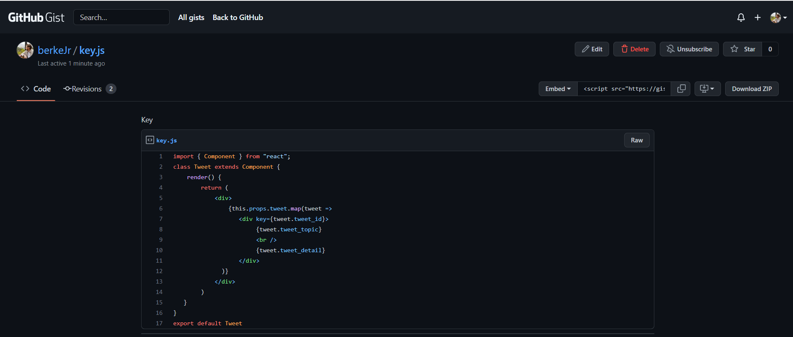
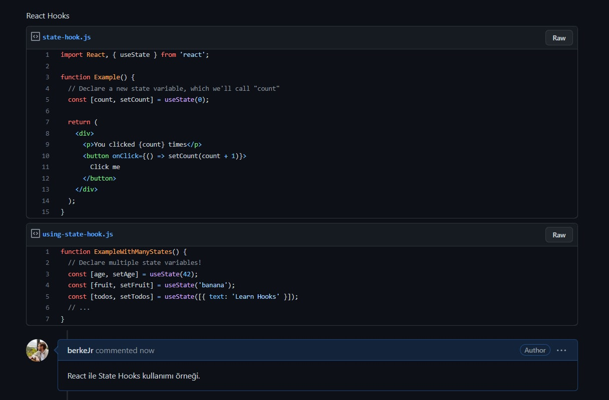
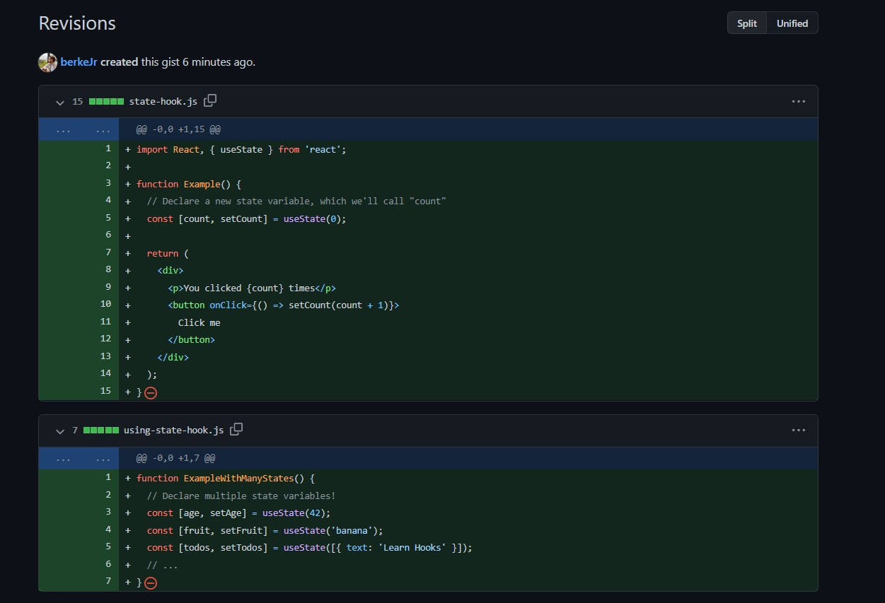
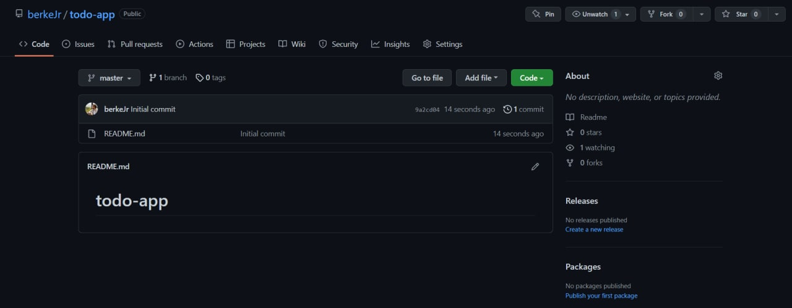
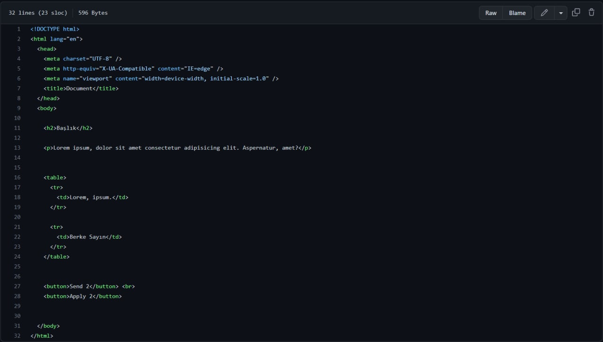
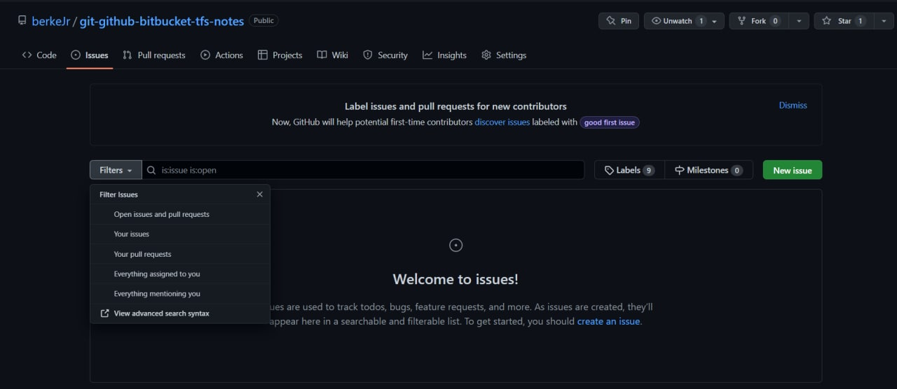
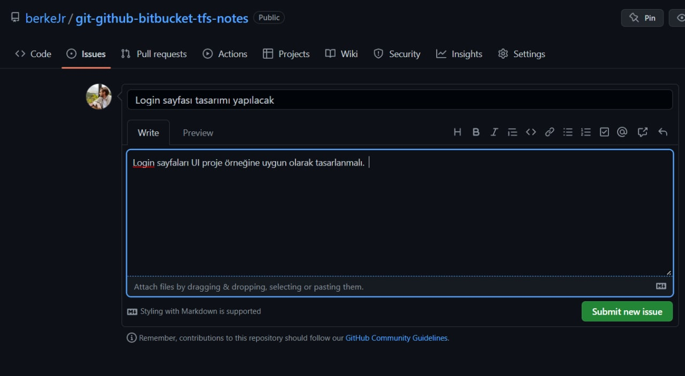
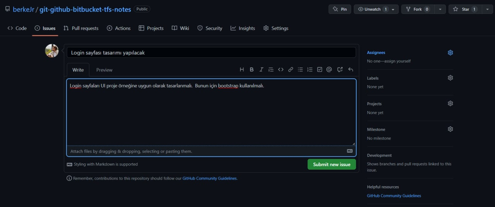
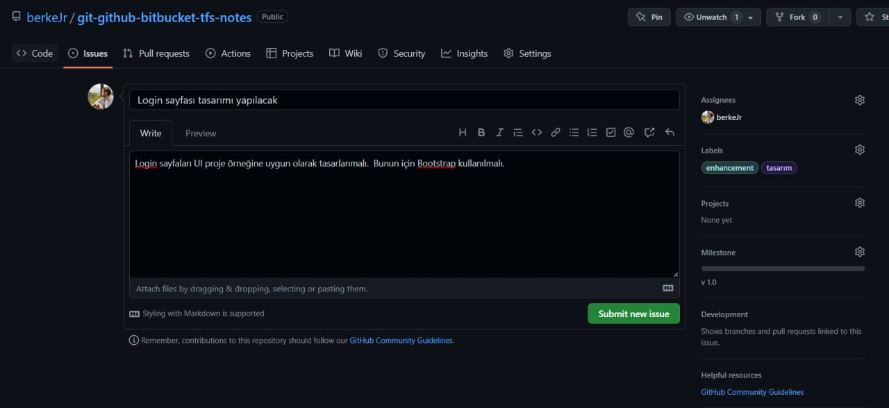
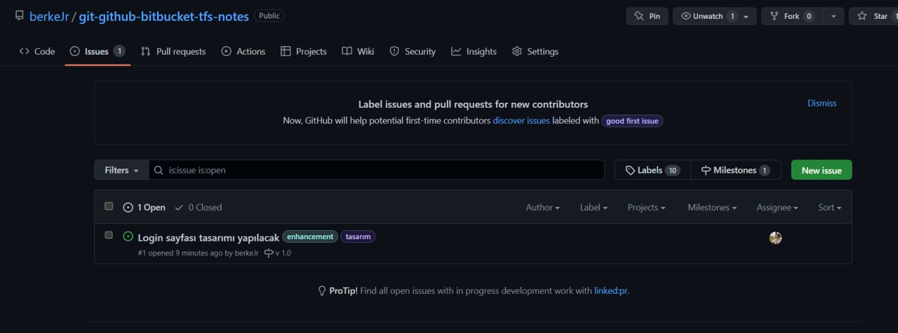

# GitHub

# Contents
* [GitHub Nedir? Github ile Çalışmak](#github-intro)
* [GitHub Hesabı Oluşturmak](#github-account)
* [GitHub Gist ile Kod Parçalarınızı Saklamak](#github-gist)
* [GitHub Repository'si Oluşturmak](#repository)
* [GitHub Üzerinde Commit, Edit ve Delete İşlemleri](#commit-edit-delete)
* [GitHub Repository Settings(Ayarları)](#github-settings)
* [GitHub Web Pages(Sayfalar) Kavramı](#github-web-pages)
* [GitHub Issues(Görevler) Bölümü](#github-issues)
* [GitHub Projects(Projeler) Bölümü](#github-projects)
* [GitHub Wiki(Rehber) Bölümü](#github-wiki)
* [GitHub Insights(Raporlar) Bölümü](#github-insights)
* [GitHub Fork(Repo Kopyalama) İşlemleri](#github-fork)
* [GitHub Pull Request(Çekme İsteği Nedir?)](#github-pull-request)
* [GitHub Pull Request(Çekme İsteği) Uygulama](#github-pull-request-app)

## GitHub Nedir? Github ile Çalışmak 
- Bu bölümde GitHub nedir, Github ile nasıl çalışırız, proje geliştirme sürecinde bize neler sağlar, bu konulara değineceğiz. Öncelikle Git ve GitHub'ın ayrımını yapmak önemli, çünkü bu 2 kavram çok fazla birbirleriyle karıştırılabiliyor. Git; şimdiye kadar öğrendik ki, local'imizde arkada çalışan bir servis. Bize repository / proejeler üzerinde versiyon kontrolünü sağlıyor. Böylelikle proje yönetimini ve takibini yapıyoruz. 

- Github ise, daha ziyade bir web sayfası / uygulaması. Bize internet / web üzerinde hizmet veriyor. Bu servisi sağlarken de, bize uzak(remote) bir repository kavramı sunuyor. Yani genel olarak, ekip halinde geliştirilen yazılım projelerinde internet tabanlı bir depolama ve yönetim alanı sunar. GitHub, Git yönetim sistemi ile geliştirilen yazılımlarda / uygulamalarda kullanılır. 

- Biz projelerimizi, uygulamalarımızı GitHub'a yüklüyoruz ve GitHub'da arka planda Git işlemlerini / komutlarını kullanarak bize proje yönetimi, ortak proje geliştirme, açık kaynak kodlara katkıda bulunma gibi imkanları sağlıyor. Bize sunduğu web sayfası / arayüz üzerinde biz repo'ları yönetiriz. 

- Yani Git; bizim arkada çalışan repo'muzu, yazılımsal projeleri yönetmemizi sağlayan bir motor ise GitHub'da bu motoru kullanarak sağladığı arayüz ile proje yönetim işlemlerini bize sunan bir yapı. 

## GitHub Hesabı Oluşturmak 
- GitHub sitesinin adresi: https://github.com

- Git ve GitHub arasındaki farklara, ikisinin de çalışma mantığına değindik. Şimdi de GitHub ile çalışmaya yavaş yavaş başlayalım. Aslında günümüzde çoğu firma GitHub kullanıyor, fakat burada sabit düşünmemek lazım. Firmalar GitHub kullandığı gibi aynı zamanda farklı projeler ve farklı ihtiyaçlar doğrultusunda GitHub dışında farklı hizmetleri de kullanabiliyorlar. Her proje takımı farklı ihtiyaçlarına göre farklı servisleri kullanabiliyor. 

- GitHub, review'lar ile kod takibi, birlikte çalışma ve aynı projeye ortak katkıda bulunma yöntemi, proje geliştirme süreci boyunca yapılan commit'ler hakkında tartışma, iletişim gibi takım arkadaşlarının veya başkalarının commit'lerini görebilmek ve onlar hakkında yorum yapmak, ve bu süreci yönetebilmek gibi olanakları sağlıyor. 

- GitHub ayrıca içerdiği Project Management Tool ile proje yönetimini de sağlıyor. 

- Ayrıca GitHub Marketplace ile farklı araçlarla birlikte kullanabiliriz. GitHub üzerinde çalışan işlerimizi kolaylaştıran eklentiler, araçlar ile verimliliğimizi arttırabiliriz. 

- GitHub'da kendi takım arkadaşlarımızla çalışabilmemize ek olarak başkalarının yazdığı repo'ları, kodları görebiliyoruz, aslında GitHub'ı yazılımın sosyal ağı olarak düşünebiliriz. Yani burada public projeleri görebiliyoruz, onlara katkıda bulunabiliyoruz, yani bir bakıma burada kendi projelerimizde de kullanabileceğimiz çok geniş bir kaynağa sahip oluyoruz. 

- Diğer uygulamalarda olduğu gibi burada da Sign-Up ile kayıt olup hesap açtıktan sonra bütün bu servislerden faydalanabiliyoruz, kullanabiliyoruz. 

- GitHub'da yazdğımız kodlar, ekledğimiz, yönettiğimiz projeler, açık kaynak olan başka repo'lara katkılarımız aslında bizim bir portföy'ümüz, cv'miz oluyor. O sebeple düzenli GitHub kullanımı ve proje geliştirme ve yönetme süreci, yazılımcılar için çok önemli. 

## GitHub Gist ile Kod Parçalarınızı Saklamak 

- GitHub Gists: https://gist.github.com

- My GitHub Gists: https://gist.github.com/berkeJr

- GitHub Gists ile biz istediğimiz kod bloklarını, yapılarını saklayabiliyoruz, orada not edebiliyoruz, ve istediğimiz zaman bakıp kullanabiliyoruz. 

- İstersek yukarıdaki linklerden Gists oluşturma ve oluşturduklarımızı görme ekranına gelebiliriz, istersek de kendi GitHub profilimizden "Your Gists" alanını seçerek görüntüleyebiliriz.    

- Yani aslında burası kod defteri gibi bir alan. "New Gist" diyerek Gist'imizi oluşturabiliriz. "View Your Gists" ile de daha önce kaydettiğimiz Gists'leri görebiliriz. 

- Gist'lerimizi de tıpkı repo'lar gibi ister public, istersek de private yapabiliriz. 

- Örnek bir GitHub Gist:

 

- Ayrıca Create Gists ile tek seferde birden fazla gist (kod bloğu) da oluşturabiliriz ve o gists'leri açıklayan yorum satırları da ekleyebiliriz.

 

- Tıpkı repo'larda olduğu gibi gists'leri de Download Zip diyerek indirebiliriz. 

- Ayrıca embed kısmında bulunan linki herhangi bir web sayfamızda, bloğumuzda yazarsak GitHub Gist şeklinde webs ayfamızda gözükür. 

 

- Edit ile Gist'lerimizi değiştirebiliriz, düzenleyebiliriz. 

- Revisions kısmında geçmişe dönük olarak neler yapıldı, gist nasıl değiştirildi, güncellendi, bunları görebiliriz.

 

- Ayrıca bizim oluşturduğumuz Gist'lere başkaları star atabilir, fork ile kendi hesaplarına çekebilir ve yorum yazabilir. 

## GitHub Repository'si Oluşturmak 

- GitHub hesabımıza giriş yaptıktan sonra "New Repository" diyerek yeni bir repo oluşturabiliyoruz. 

 

- Burada şu anda todo-app isminde bir repo oluşturduk. "Add File" kısmından istersek "New File" diyerek yeni dosyalar ekleyip düzenleyebiliriz, istersek de "Upload File" diyerek de cihazımızda var olan klasörü/dosyaları yükleyebiliriz. 

- Issues, Pull Requests, Actions, Projects, Wiki, Security, Insights, Settings alanlarından diğer işlemleri yönetebiliriz. 

- Repo içerisinde geçmişe dönük olarak proje commit'lerini, hangi commit işlemi kim tarafından ne zaman gerçekleştirildi, projeye katkıda bulunanlar, projede hangi branch'ler oluşturuldu, nasıl bir dallanma yapısına gidildi, bunları buradan inceleyebiliriz. 

## GitHub Üzerinde Commit, Edit ve Delete İşlemleri 

- Şimdi de GitHub üzerinde commit işlemlerine bakalım. GitHub web sayfasından bize sunduğu ekran üzerinden dosya ekleme, karşı tarafa upload etme, orada dosyaları düzenleme veya silme, veya GitHub üzerinde commit işlemlerini gerçekleştirme fonksiyonlarına bakalım. 

- GitHub 'da bir repo'ya klasör/dosya eklemek için "Create New File" veya "Upload Existing File" seçeneklerini kullanırız. Ayrıca "Download Zip" ile veya `git clone` komutu ile repo'yu localimize indirip orada çalışmaya devam edebiliriz. 
 
 

- Burada gözüktüğü gibi repo içerisinde istediğimiz dosyayı github'da görüntüleyebiliyoruz. Daha sonra üstteki bar'da bulunan tool'lar ile inceleme ve edit işlemleri yapabiliyoruz. Örneğin "Row" ile kodun stillerden, renklerden arınmış halini görebiliriz, "Blame" ile de o dosyada hangi satırlar kim tarafından, ne zaman değiştirilmiş, bunların takibini sağlayabiliyoruz. "History" ile de o dosyanın ilk oluşturulduğu andan itibaren tüm commit geçmişlerini, o commitlerde neler yapıldığını yine görebiliyoruz. "Kalem işareti" ile "Edit" işlemi yapıp kodu güncellyebiliriz veya "Delete" ile de dosyayı silebiliriz. 

## GitHub Repository Settings(Ayarları) 

## GitHub Web Pages(Sayfalar) Kavramı 

## GitHub Issues(Görevler) Bölümü 

- Şimdi de GitHub üzerinde "Issues" kavramına bakalım. Takım halinde bir proje üzerinde çalıştığımızı varsayalım. Takımdaki geliştiricilerin bu projeyle ilgili veya bu proje üzerinde yapacaklarını görevlendirmeye / proje yönetimine ihtiyaç duyarız. Buna görev yönetimi / issue management diyebiliriz. İşte GitHub Issues bize görevleri yönetebileceğimiz bir alan sunuyor. Hangi geliştiricinin ne görevi var, şu anda ne durumdayız şeklinde izleme / takip yapmak için Issues alanını kullanabiliriz. 

- GitHub üzerinde herhangi bir repo için görev yönetimi / takip yapmak adına Issues kullanmak istiyoruz diyelim. Bunun için o repo'da bulunan Issues alanına gideriz. 

 

- Burada filters alanında issue'leri / pull request'leri görebiliriz. Burada yeni bir issue (görev) oluşturmak için "New Issue" butonuna tıklarız. 

- Bu görevleri oluştururken aslında projemize göre anlamlı şeyler yapmamız gerekir. Mesela login / register sayfaları yapılacak veya login sayfasının database'deki tabloları oluşturulacak gibi.  

 

- Title'a görev adını yazdıktan sonra açıklama alanına da o görevle ilgili ayrıntıları / yapılması gerekenleri detaylıca yazabiliriz veya bilgisayardan herhangi bir dosyayı sürükleyip bırakabiliriz, @ işareti ile birilerini mention'layabiliriz. Başlığın altında bulunan bar'daki tool'ları kullanabiliriz. Örneğin başka bir issue veya pull request'i referans gösterebiliriz (örenğin bu issue buna bağlıdır, bununla alakalıdır gibi).  

 

- Ayrıca oluşturmak istediğimiz issue için sağ tarafta bulunan fonksiyonları da kullanabiliriz. Örneğin Assign ile o issue'yü birisini atayabiliriz / görevlendirebiliriz. Kendimize atamak için "assign yourself'e" tıklayabiliriz. Bu noktada bu atama işini projeye katkıda bulunabilecek Collaborators'lar arasından birisine gerçekleştirebiliriz. Burada bir görevi bir kişiye de birden çok kişiye de atayabiliriz. 

- Assign'ın altında bulunan "Labels" ile de bu görev ne, yani bu görevde neler yapılacak (bug solve, enhancement, question, help wanted yani yardım aranan görevdir) gibi etiket ekleyerek o görev hakkında kısa bilgi verebiliriz. Burada var olan hazır label'ları da kullanabiliriz veya kendimiz de bir label oluşturabiliriz. 

- Daha sonra "Projects" alanında eğer bu issue bir projeye aitse onu belirtebiliriz. 

- "Milestone" alanı ise aslında eşik noktası anlamına geliyor. Örneğin bu uygulamanın ilk versiyonunun yayınlanması veya versiyon 2 / versiyon 3'ün yayınlanması veya bir bug-fix'in yayınlanması gibi aşamalar eşik noktası (milestone)olabilir. Bu alanda da bu issue (bu görev) bu milestone'a aittir diyebiliriz. Orada da milestone adını yazarak create deyip o görevi o milestone'a atayabiliriz. 

- Şu anda artık "Submit New Issue" diyerek yeni görevi oluşturabiliriz. 
  
 

- Daha sonra yine Issues alanında o repo'ya ait bütün Issue'leri görebiliriz. Şu anda az önce oluşturduğumuz "Login sayfa tasarımı yapılacak" isimli issue hala open durumunda. Ayrıca o open olan issue ile ilgili yeni yorum yazabiliyoruz, geliştirme şu aşamada, şimdiye kadar şunları yaptık gibi. 

- Daha sonra da görev bitince de "Close Issue" diyerek görevi kapatabiliriz. Bu da görevin yapıldığını veya yapılmadığını / ne aşamada olduğunu takip etmeyi sağlar. 

- Örneğin o görev tamamlanamayacak gibiyse "Labels" alanından o görev tamamlanamayacak "wont fix" gibi bir label ekleyebiliriz. 

- Issue oluştururken başlık altına yazdığımız comment aslında o issue için oluşturduğumuz ilk comment oluyor. Daha sonra o aşlık (o issue) için yeni comment'ler oluşturabiliriz veya var olan bir comment'i düzenleyebiliriz. 

- Aynı şekilde o repo farklı görevleri belirlemek ve projeyi yönetebilmek için New Issue oluşturabiliriz. 

- En son "Close Issue" diyerek de Issue'yi kapatabiliriz. Ayrıca kapattığımız bir Issue'yü daha sonra "Reopen Issue" diyerek de yeniden açabiliriz. 

 

- Daha sonra tekrar o repo için issues alanına geldiğimizde açık ve kapalı olan issue'leri görebiliriz veya "filters" alanından issue'leri aramak istediğimiz şekilde filtreleyebiliriz. Orada issue kim tarafından açıldı, başlığı içeriği ne şeklinde görebiliriz veya ayrıntılı şekilde de inceleyebiliriz. 

- Issue'lerin listelendiği yerde bulunan Labels ve Milestones alanında issue'ler için oluşturulan ve kullannılan label ve milestone'ları görebiliriz. 

## GitHub Projects(Projeler) Bölümü 

## GitHub Wiki(Rehber) Bölümü 

## GitHub Insights(Raporlar) Bölümü 

## GitHub Fork(Repo Kopyalama) İşlemleri 

- Şimdi de GitHub üzerinde "Fork" kavramına bir bakalım. Fork, aslında repository'leri kopyalamak için kullandığımız bir teknik. İster o repo'da takım arkadaşı olalım, yani söz sahibi, collaborator(commit atma yetkisine sahip geliştirici), istersek de söz sahibi olmadan, dışarıdan public repo'ya erişip o şekilde kendi hesabımıza Fork işlemi ile bir kopyasını alabiliriz. Yani collaborator veya contributer olmamız fark etmiyor, her türlü Fork'lama yapıp kopya alabiliriz ve daha sonra kendi hesabımızdaki kopya üzerinde özgürce takılabiliriz, sanki repo'nun sahibi bizmişiz gibi. Aslında repo'nun o anki kopyasını almış oluyoruz ve kimden aldığımızda altında belirtiliyor. Dolayısıyla bu şekilde, sanki repo bizimmiş gibi, ekleme, çıkarma yapabiliyoruz, özgürce çalışabiliyoruz. Ama orjinal repo sahibine bu değişiklikler yansımayacaktır. Bizim kendi hesabımızdaki kopyada bu işlemler gerçekleştirilir. Ona yansıtma işlemi ise "Pull Request" dediğimiz kavram ile oluyor. 

- GitHub'da herhangi bir open source (public) projeyi inceleyip istersek Fork ile kopyasını alabiliriz. Bu durumda incelediğimiz repo'nun içerisinde bulunan "Fork" işleminden faydalanırız. Aynı şekilde projenin kaç kişi tarafından fork'landığı da gösterilir. 

- Fork'ladığımız proje de çalışırken, değişiklikler yaptığımızda bu direk olarak repo sahibine, yani ana repo'ya yansımaz, bu işlem için Fork'a ek olarak "Pull Request" işlemi gerçekleştirilmelidir. 

- Ayrıca biz bir repo'yu beğendimizde ona star atabiliriz veya o repo'yu kaç kişi star'lamış, onu da görebiliriz. Ona ek olarak eğer biz bir repo'yu "Watch" ile izlemeye alırsak, o repo içerisindeki bütün commit veya request'te veya proje içerisindeki herhangi bir conversation'larda, konuşmalarda, yorumlaşmalarda bize de bildirim gelir. 
 

## GitHub Pull Request Nedir? 

- Şimdi de GitHub üzerinde Pull Request işlemlerine bakalım. 

- Örneğin GitHub üzerinde public bir repo'yu, projeyi beğendik ve ona katkıda bulunmak istiyoruz. Bunun için ilk olarak beğendiğimiz repo'yu Fork ile kendi repo'larımız arasına çekeriz, yani o anki halinden bir kopyasını alırız. 

- Daha sonra git clone <'url'> ile projeyi kendi masaüstümüze clone'larız, indiririz, ayrıca bu komut ile indirince, proye içerisinde bütün git komutlarını da kullanabiliriz. 

- Masaüstümüzde bulunan projeyi herhangi bir kod editörü ile açarız ve kod üzerinde istediğimiz değişiklikleri yaparız ve daha sonra kaydedip commit'leriz.  

- Bu durumda kendi repo'larımız içerisinde bulunan Fork'ladığımız projeyi değiştirdik, güncelledik. Fakat bu doğrudan repo sahibine (ana repo'ya) gitmez. 

- İşte yaptığımız değişiklikleri, ana repo'ya göndermek için, yani başkasının public projesine katkıda bulunabilmek için "Pull Request" işlemini kullanırız.

- GitHub üzerinde Fork'ladığımız projede yeni değişiklikleri commit'ledik ve bunları Pull Request ile ana projeye göndermek istiyoruz. Bu durumda kendi sayfamızda bulunan Fork'ladığımız projede Pull Request alanına geliriz ve istediğimiz commit'leri ana repo'ya (projenin sahibine göndeririz).

- Daha sonra ana repo sahibine bildirim gelir. Kendi projesine geldiği zaman "Pull Request" alanında değişiklik yapmak isteyen, yani projesine katkıda bulunmak isteyen kişinin gönderdiği istekler gelir.

- Ana proje sahibi bu değişiklikleri inceler, eğer beğenirse ve kendi projesine taşınmasını isterse "Merge Request" ile değişiklikleri onaylar, merge eder, yani birleştirir.

- Böylece ana projenin Contributors kısmına Pull Request ile katkı yapan kişi de eklenir. 

- Daha sonra ana proje sahibi GitHub üzerinde yapılan bu değişikliklerii kendi local'inde bulunan klasörüne çekmek için de; 
`git pull origin master` komutunu kullanır.

- Bu durumda dışarıdan GitHub kullanıcıları, başkasının herhangi bir reposundaki kodları kendi yetkileri dışında doğrudan değiştiremezler, sadece yapmak istedikleri değişiklikleri Pull Request ile gönderebilirler. Daha sonra da proje sahibi isterse değişiklikleri onaylar, merge eder.

- Temel mantık şudur. Ben senin projeni beğendim, inceledim, ama sanki şu kodu şöyle yapsan, veya atıyorum uygulamaya şu chat modül kodunu da entegre etsen daha güzel olur gibi. İşte bu durumda Pull Request ile istek atılır. 

##### Not: Local Repository  &&  Remote Repository:  
- Bizim kendi bilgisayarımızda oluşturduğumuz ve üzerinde git komutlarını kullandığımız, yani git init komutu ile git repository'si haline getirdiğimiz klasör-proje, bizim local repo'muz oluyor.

- GitHub, BitBucket, TFS gibi ortamlara yüklediğimiz aktardığımız repo'lar ise bizim remote repository'lerimiz oluyor.

- İlk olarak masaüstümüzde(local'imizde) bir proje oluşturup onu remote şekilde GitHub, BitBucket, TFS gibi web tabanlı servis sağlayıcılarına(uzaktaki sunucuya) atabiliriz ve böylelikle proje takibimizi hem local ortamdan hem de remote şekilde gerçekleştirebiliriz. 

- Projemizi git repo'su haline getirdikten sonra her birbiriyle bağlantılı değişiklikleri "git commit" komutu ile commit ederek, değişikliğin belli bir kod ile git veritabanına kaydedildiğinden bahsetmiştik. 

- Bu noktada local'de yaptığımız değşikliği(commit'i) remote repo'ya aktarmak için; `git push origin master` ,

- Diğer taraftan da remote ortamda yaptığımız değşikliği local repo'muza aktarmak için; `git pull origin master` komutlarını kullanırız.

- Remote ile local repo kavramları arasındaki aslında en temel fark ise şu. Takım halinde bir uygulama/proje üzerinde çalıştığımızı düşünelim. Örneğin 5-6 kişilik bir ekibiz, ve 5'imiz de uzakataki sunucuya, yani GitHub, BitBucket, TFS vs. üzerindeki repo'yai kendi local'lerinde geliştirdikleri commit'leri atıyorlar ve herkesin yazdığı kod aslında remote repo'da birikiyor(code-base). Yani remote repo'da bizde olmayan kodlar da var(takım arkadaşlarımızın yazdığı kodlar). Yeri geldiğinde ise o kodları, takım arkadaşlarımızın da yazdığı kodları, bir başka deyişle remote repo kodlarını kendi local'imize çekmemiz gerekiyor. İşte bu durum için de "pull" komutunu kullanıyoruz.
`git pull origin branch_name(master)`

- push: local'den remote'a göndermek için kullanılır.

- pull: remote'dan local'e çekmek için kullanılır.  

## GitHub Pull Request Uygulama 

- Pull Request işleminin yapısından, neden ihtiyaç duyduğumuzdan, ve adım adım nasıl kullanıldığından bir önceki bölümde bahsettik. Burada ise mantığını kısaca özetlemek istiyorum.

- GitHub'da açık kaynak projeleri inceliyoruz. Belki bir arkadaşımızın, veya hiç tanımadığımız birisinin projesini incelerken bir hata, eksik olduğunu farkettik. Ya da kod, proje çok hoşumuza gitti, onun üzerine farklı bir değişiklik ekleyip, yeni bir özellik katmak istiyoruz. İşte bu durumda o repo'yu forklayıp, değişiklikleri yapıp, repo/proje sahibine, senin projende şu tarz değişiklikler, güncellemeler yaptım, şu özellikleri ekledim diyerek "Pull Request" atıyoruz yani değişiklikleri gönderiyoruz. Proje sahibi değişiklikleri mantıklı bulursa bunları kendi projesine taşıyor, merge ediyor. Ve biz de açık kaynak projeye katkıda bulunmuş oluyoruz.

- ##### Not: Birisinin projesine pull request atabilmek için, ilk olarak o repo'yu fork ile kendi repo'larımız arasına çekmiş olmamız gerekiyor. 

- ##### Not: Pull Request yöntemi dışında ortak proje geliştirme, yani bir repo'ya birden çok kişinin katkı yapması da sağlanabilir. Diyelim, kendi github repo'larımız arasında bir projemiz bulunuyor, ve onu bir ya da birkaç arkadaşımızla birlikte geliştirmeye devam etmek istiyoruz. Bu durumda o repo'ya gideriz ve o repo için "Settings" yani ayarlar kısmına gidip "Collaborators" alanına gideriz. Orada "Add People" alanından birlikte çalışmak istediğimiz arkadaşımızı davet ederiz. Böylece o kişi invitation'ı kabul ettikten sonra, o projenin fork'unu almadan da o projeye commit yapabilir, yani projeye katkıda bulunabilir. Yani Add Collaborator özelliği takım arkadaşının Fork yapmadan ve de Pull Request atmadan değişiklik yapabilmesine olanak sağlıyor. Buna ek olarak, aynı şekilde, Add Collaborator ile eklenmiş takım arkadaşı isterse Fork ile projenin bir kopyasını kendi repo'ları arasına çekebilir. Daha sonra local'inde sürekli olarak proje kopyası ile çalışıp istediğinde pull request olarak da projeye katkıda bulunabilir. 

- Hatırlatma olarak, bir projeyi Fork'ladıktan sonra, yani başka bir kopyası üzerinde çalışırken Pull Request gönderebiliriz. Fakat Add Collaborator özelliği ile Fork + Pull / Merge Request işlemlerine gerek kalmadan o repo içerisinde takım arkadaşları özgürce geliştirme yapabilir. Takım arkadaşı olmayan birisi doğrudan commit atamayacağı, değişiklik yapamayacağı için mecburen Fork'lamak ve Pull Request atmak zorunda kalıyor(eğer o repo üzerinde katkıda bulunmak, değişiklik yapmak istiyorsa).

